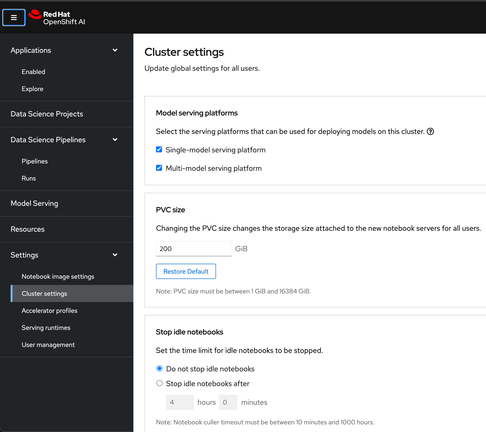
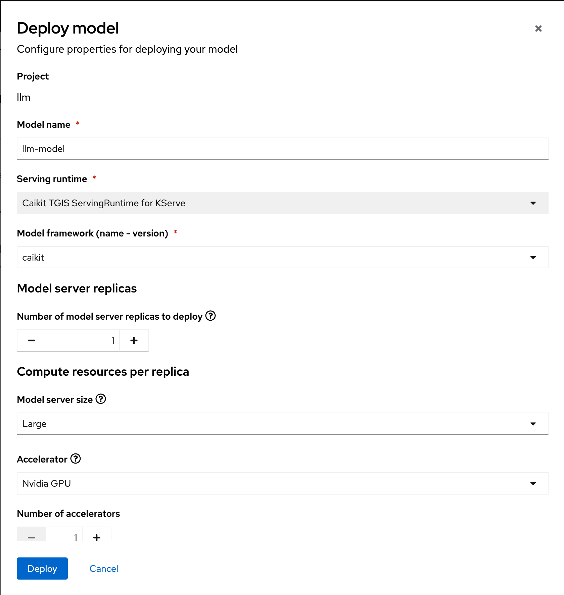

# Settings
1. Change default PVC size to 200 Gb and save 
   1. 
2. Create Accelerators profiles 
   1. oc apply -f https://raw.githubusercontent.com/arslankhanali/openshift-helper/main/crds/ai_acceleratorprofile.yaml
   2. 
3. Choose single model serving platform in cluster settings
   

### Work bench
1. Env variable
   1. Setup hugging face
      1. 
   2. cluster token and server endpoint

### Model Deploy
1. Noobaa gave SSL error
2. Minio gave model not found error
   1. 
   2. 

### Data connection
1. For minio use minio-api url not minio-ui
   1. 
2. By default it has 100gb space
3. Noobaa
   1. 

# Ray
1. Run 1_create_ray.ipynb to create a ray cluster and submit a llmfinetune python script to run
   1. Give hugging face token. Get from https://huggingface.co/settings/tokens
   2. Give openshift cluster token and server. Can get from https://oauth-openshift.apps.cluster-jvn94.sandbox991.opentlc.com/oauth/token/display
2. Run 2_inferdemo.ipynb to infer the demo that you pushed to hugging face
   1. Change huggingface address from 'arslankhan' to your url name
3. 